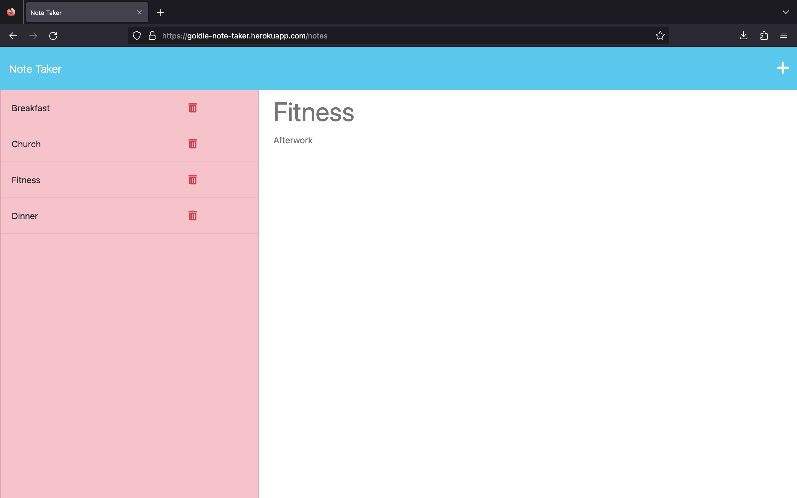

## 🗒️ Note Taker App 🗒️

## Description

This application helps to organize tasks and delete them after they are completed. 

- When users log into the application, they are going to see a landing page that contains a link to their notes page
- When users enter new notes, a Save icon appears in the right top corner
- When users click the Save Icon, the new note appears in the left side
- When users click on the Write (+) icon it allows the add a note
- When users click on the Delete icon a note will be deleted

## Table of Contents

  <ul>
    <li>
      <a href="#description">Description</a>
    </li>
    <li>
      <a href="#installation">Installation</a>
    </li>
    <li>
      <a href="#demo">Usage</a>
    </li>
    <li>
        <a href="#license">License</a>
    </li>
    <li>
        <a href="#questions">Questions</a>
    </li>
    <li>
        <a href="#resourses">Resourses</a>
    </li>
    <li>
        <a href="#credits">Credits</a>
    </li>
  </ul>
   

  ## Installation

 The application utilises Express.js for back end and is deployed on Heroku platform.

Check out the Note Taker App [here!](https://goldie-note-taker.herokuapp.com/)

## Usage
## 

## 
## Questions

If you have any questions regarding this project, please don't hesitate to contact me using my email address: zlatelinarizova@gmail.com. You can find my project repositories here: [Goldie369](https://github.com/Goldie369).

## Resourses
- [Node.js](https://nodejs.org/en/)
- [Heroku](https://devcenter.heroku.com/)
- [Express.js](https://emojipedia.org/)
- [Best README Template](https://github.com/othneildrew/Best-README-Template/blob/master/README.md)
- [Youtube]https://www.youtube.com/watch?v=K9jTQPb0Xso
- [Youtube]https://www.youtube.com/watch?v=SyiL0J80gDQ
- [Youtube]https://www.youtube.com/watch?v=wiFW3gQgfd8
- [GitHub]https://github.com/john-abou/note-taker
- HTML
- CSS
- [Json]https://www.npmjs.com/package/json

## Credits 

Big Thanks to my tutor Collin Porter [Collin Porter!](https://github.com/portercol) for the help support and help on this assighment.
Highly recommend!!!

